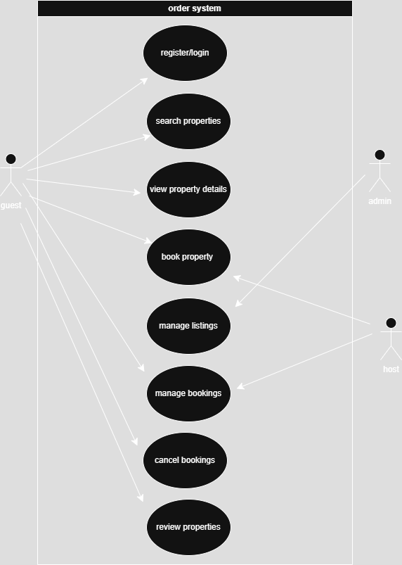

## What is Requirement Analysis?

Requirement Analysis is the process of understanding and documenting what a software system should do. It involves engaging with stakeholders to gather, analyze, and validate their needs, ensuring the development team builds a product that meets expectations. In the Software Development Lifecycle (SDLC), requirement analysis serves as the foundation for all other phases—design, implementation, testing, and deployment—making it critical to project success.

## Why is Requirement Analysis Important?

1. **Prevents Scope Creep:** It clearly defines what the project will deliver, minimizing changes during development.
2. **Aligns Stakeholders:** Ensures all parties involved share the same understanding and expectations of the final product.
3. **Saves Time and Costs:** Reduces rework by identifying problems early, avoiding expensive fixes during later stages.

## Key Activities in Requirement Analysis

- **Requirement Gathering:** Collecting basic requirements from stakeholders through interviews, surveys, etc.
- **Requirement Elicitation:** Refining requirements using techniques like brainstorming, storyboarding, and prototyping.
- **Requirement Documentation:** Writing detailed specs, use cases, and user stories.
- **Requirement Analysis and Modeling:** Analyzing relationships between requirements and creating models like use case diagrams.
- **Requirement Validation:** Reviewing the requirements with stakeholders to ensure accuracy and feasibility.

## Types of Requirements

### Functional Requirements

Functional requirements describe **what the system should do**.

Examples for the booking system:

- Users can register and log in.
- Hosts can list properties.
- Guests can search for and book available properties.

### Non-functional Requirements

Non-functional requirements describe **how the system should perform**.

Examples:

- The system must load pages in under 2 seconds.
- The platform must be available 99.9% of the time.
- All user data must be encrypted and stored securely.

## Use Case Diagrams

Use Case Diagrams help visualize the interactions between users (actors) and the system. They provide a high-level overview of system functionality, making it easier to understand the scope and interactions.

## Acceptance Criteria

Acceptance Criteria are the conditions a feature must meet to be considered complete and acceptable to stakeholders.

**Example: Checkout Feature in Booking System**

- User must be logged in to initiate checkout.
- Booking details must be reviewed before payment.
- Payment must be processed via integrated payment gateway.
- Confirmation message must be shown upon successful booking.
